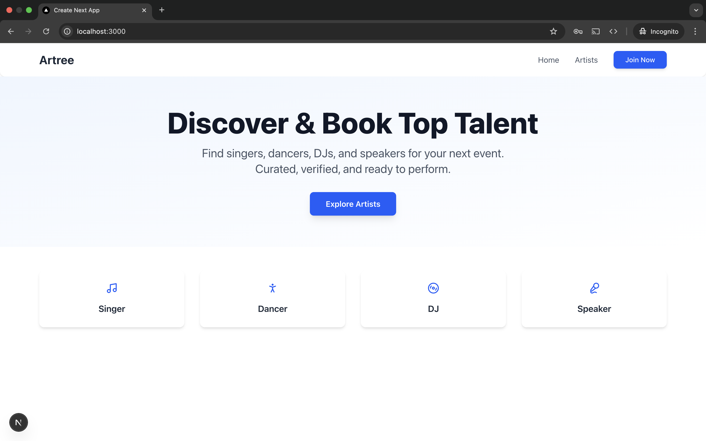
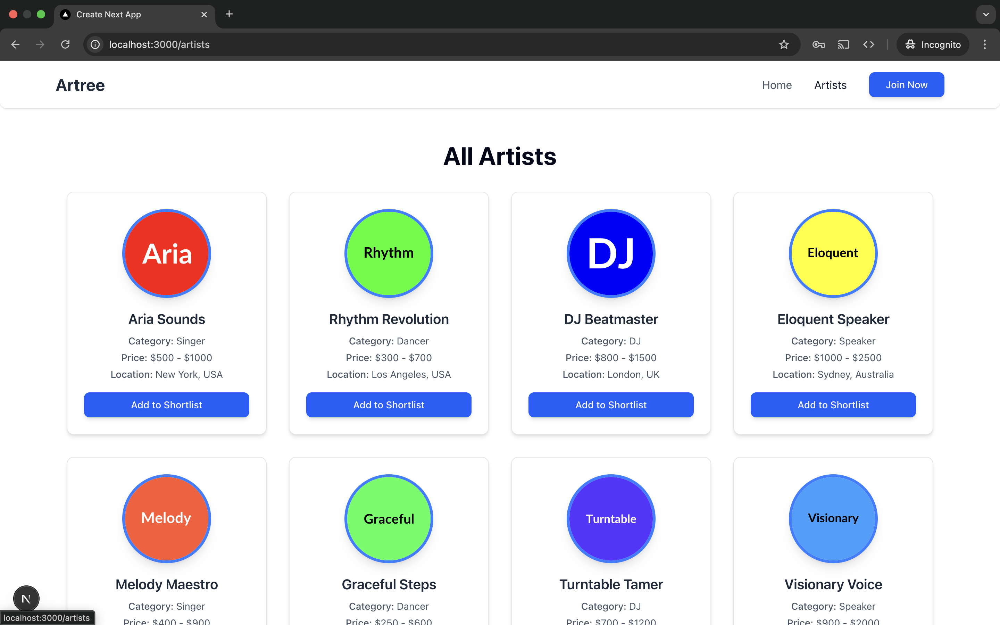
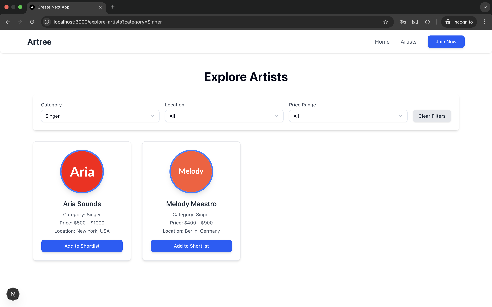
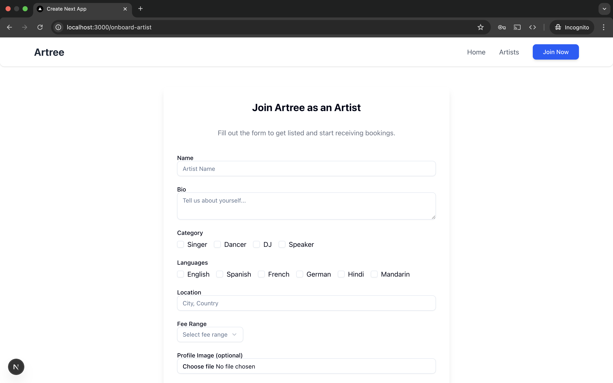

# 🎨 Artree —  Frontend Demo

[](https://nextjs.org/)
[](https://tailwindcss.com/)
[](https://ui.shadcn.com)
[](https://vercel.com)
[](#license)

A fully responsive, polished frontend for a fictional **Performing Artist Booking Platform** , built as part of a frontend developer test assignment. Demonstrates clean code structure, dynamic forms, filterable artist listings, and production-ready UX using **Next.js 13+**, **React**, **Tailwind CSS**, and **ShadCN UI**.

---

## 🚀 Live Demo

🔗 [artree.vercel.app](https://artree.vercel.app) – accessible worldwide via Vercel deployment.

🎥 **Demo Preview**  




---

## 🧑‍🎤 Features

- **Next.js 13+ App Router** for modern routing and layout
- **Tailwind CSS** + **ShadCN UI** for clean and responsive design
- **Artist Listing** with category, location, and price-range filters
- **Multi-step Onboarding Form** with validation (React Hook Form + Yup)
- **Reusable Components**: artist card, filter panel, form input, navigation
- Fully **responsive layout** – desktop grid / mobile list
- Mocked backend using JSON for quick prototyping

---


---

## 🛠️ Setup & Run Locally

```bash
git clone https://github.com/your-username/artree.git
cd artree
npm install
npm run dev


